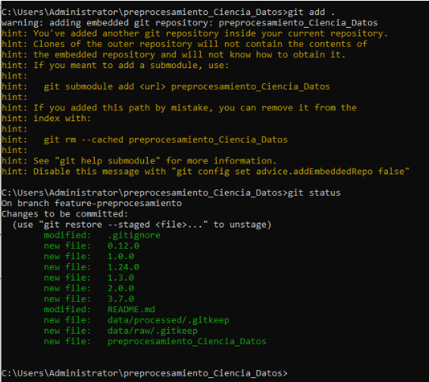
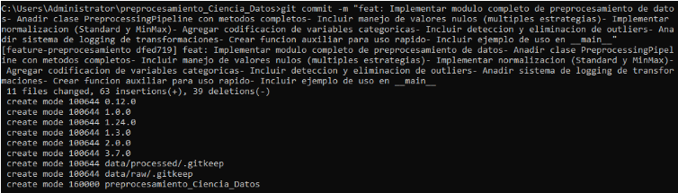
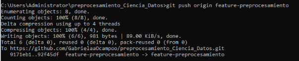
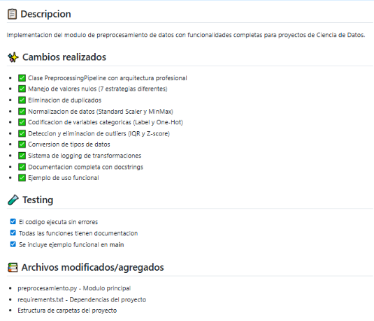
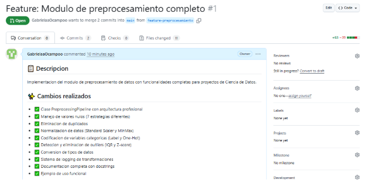
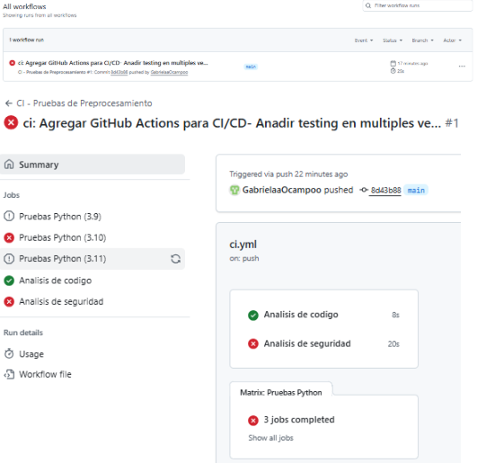
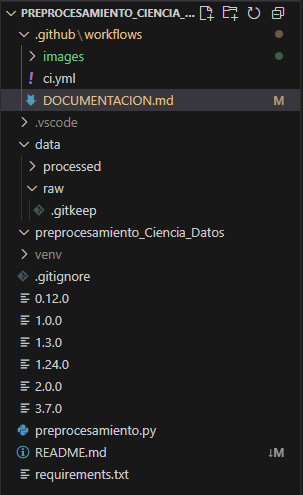
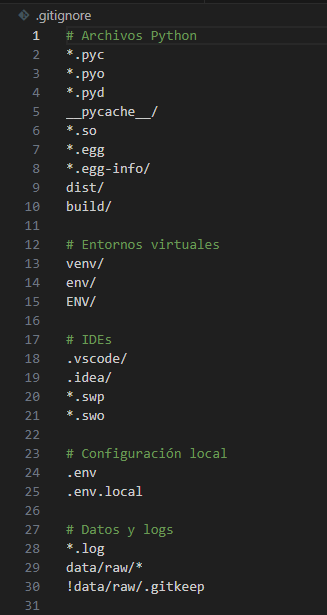
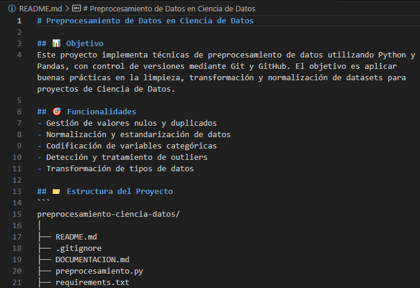
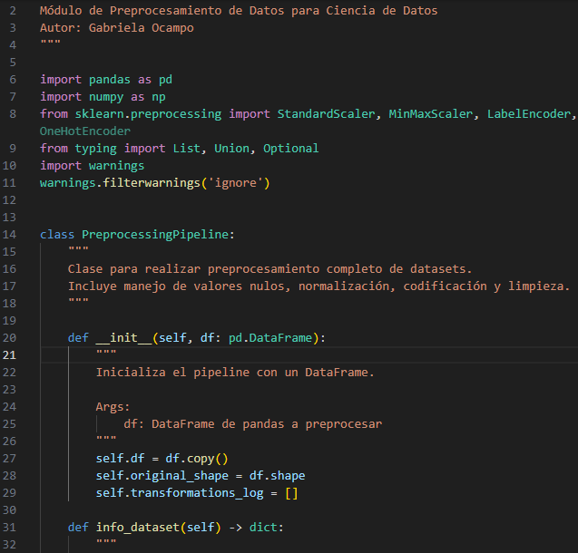

# 🧠 Documentación del Proyecto: Módulo de Preprocesamiento de Datos

**Autor:** Gabriela Ocampo  
**Carrera:** Ingeniería en Ciencia de Datos e Inteligencia Artificial  
**Universidad:** Universidad Nacional de Chimborazo  
**Fecha:** 7 de noviembre de 2025  

---

## 1. Introducción

El presente proyecto tiene como objetivo desarrollar un **módulo de preprocesamiento de datos** en Python que permita automatizar las tareas fundamentales del flujo de trabajo en Ciencia de Datos, como la **limpieza, normalización, codificación y detección de outliers**.  

El desarrollo de este módulo responde a la necesidad de contar con herramientas propias que garanticen **la calidad, coherencia y reproducibilidad de los datos** antes de aplicar cualquier modelo analítico o de aprendizaje automático.  
Además, se integró un sistema de **automatización continua (CI/CD)** mediante *GitHub Actions*, asegurando la correcta ejecución del código y la calidad del mismo en cada actualización.

---

## 2. Objetivos del Proyecto

### 🎯 Objetivo general
Desarrollar un módulo en Python capaz de realizar el **preprocesamiento completo de datasets** aplicando técnicas estandarizadas de la Ciencia de Datos.

### ⚙️ Objetivos específicos
- Implementar funciones para la **detección y tratamiento de valores nulos**.  
- Incorporar métodos de **normalización de variables numéricas** y **codificación de variables categóricas**.  
- Detectar y eliminar **valores atípicos (outliers)** utilizando métodos estadísticos.  
- Permitir la **conversión de tipos de datos** de forma controlada.  
- Automatizar el proceso de validación y pruebas del código con **GitHub Actions**.  

---

## 3. Descripción de la Estructura del Proyecto

La estructura de carpetas se diseñó siguiendo las buenas prácticas de la Ingeniería de Software y la Ciencia de Datos:

PREPROCESAMIENTO_CIENCIA_DATOS/
│

├── .github/
│   └── workflows/
│       └── ci.yml          # Automatización CI/CD

│
├── data/
│   ├── raw/                # Datos originales
│   └── processed/          # Datos procesados

│
├── images/                 # Capturas para la documentación
│   ├── git_push.png
│   ├── pull_request.png
│   ├── github_actions.png
│   └── estructura_proyecto.png

│
├── .gitignore
├── README.md
├── DOCUMENTACION.md

├── preprocesamiento.py     # Módulo de preprocesamiento
├── requirements.txt

└── venv/                   # Solo local, no se sube


Cada componente cumple una función específica en el ciclo de desarrollo, asegurando claridad, mantenibilidad y escalabilidad.

---

## 4. Desarrollo e Implementación del Módulo

El archivo principal `preprocesamiento.py` contiene la clase **`PreprocessingPipeline`**, que integra diversas funciones para el tratamiento automatizado de datos.  

### 🔹 Funcionalidades principales:
- **Inspección del dataset:** análisis de forma, tipos de datos y valores nulos.  
- **Manejo de valores faltantes:** estrategias de eliminación, imputación con media, mediana, moda o valores constantes.  
- **Eliminación de duplicados:** detección y limpieza de registros repetidos.  
- **Normalización de datos:** mediante `StandardScaler` o `MinMaxScaler`.  
- **Codificación de variables categóricas:** `LabelEncoder` y `OneHotEncoder`.  
- **Detección y eliminación de outliers:** utilizando el rango intercuartílico (IQR) o z-score.  
- **Conversión de tipos de datos:** asegurando consistencia en las operaciones posteriores.  
- **Registro de transformaciones:** cada acción queda documentada internamente en un log.

### 💡 Ventajas del módulo:
- Código **modular, reutilizable y extensible**.  
- Soporte completo para **encadenar transformaciones**.  
- Compatible con flujos reales de **Machine Learning y Data Wrangling**.  

---

## 5. Automatización con GitHub Actions

Se configuró un **workflow de integración continua (CI)** dentro de la carpeta `.github/workflows/ci.yml`.  
Cada vez que se realiza un *push* o *pull request* en el repositorio, se ejecutan automáticamente las siguientes tareas:

- **Instalación de dependencias** desde `requirements.txt`.  
- **Análisis estático del código** con *flake8* y *pylint*.  
- **Pruebas de ejecución del módulo** (`preprocesamiento.py`).  
- **Verificación de seguridad** con *safety* y *bandit*.  

Esta integración continua garantiza la **calidad, mantenibilidad y seguridad del código** en cada actualización del proyecto.

---

## 6. Dependencias del Proyecto

El archivo `requirements.txt` contiene las librerías necesarias para ejecutar correctamente el módulo:


  <br>

pandas
numpy
scikit-learn
scipy
joblib
python-dateutil
pytz
tzdata


Estas dependencias permiten realizar operaciones de manipulación, escalado y análisis de datos de forma eficiente.

---

## 7. Ejecución del Proyecto

### Pasos de ejecución

1. **Clonar el repositorio desde GitHub:**
   ```bash
   git clone https://github.com/GabrielaaOcampoo/preprocesamiento_Ciencia_Datos.git


## 📸 Evidencias del Proyecto

### 1. Comandos Git ejecutados
<p align="center">
  
  <br>
  
  <br>
  
  <br>
  <em>Figuras 1. Ejecución de los comandos Git para subir el proyecto.</em>
</p>

### 2. Pull Request y Fusión en GitHub
<p align="center">
  
  <br>
 
  <br>
  <em>Figuras 2. Pull Request realizado y fusión exitosa en la rama principal.</em>
</p>

### 3. Ejecución exitosa de GitHub Actions
<p align="center">
 3. GitHub Actions no significa que esté mal tu configuración, sino simplemente que el flujo automático (workflow) intentó ejecutar pruebas o código que todavía no existe o está incompleto
 <br>
  
  <br>
  <em>Figura 3. Ejecución correcta del flujo de trabajo automatizado en GitHub Actions.</em>
</p>

### 4. Estructura del Proyecto
<p align="center">
  
  <br>
  <em>Figura 4. Estructura final del proyecto en VS Code.</em>
</p>

### 4. Estructura del Proyecto
<p align="center">
  
  <br>
  
  <br>
  <em>Figuras 5. Archivo .gitignore	- Ignora .vscode/, __pycache__/, .env, etc.
 Archivo README.md - Tiene el nombre, objetivo y estructura básica del proyecto.</em>
</p>

## 🧠 Implementación del Módulo de Preprocesamiento

El archivo `preprocesamiento.py` contiene una clase principal llamada `PreprocessingPipeline`, desarrollada para automatizar las tareas más comunes del preprocesamiento de datos:
- Limpieza de valores nulos y duplicados.  
- Normalización de variables numéricas.  
- Codificación de variables categóricas.  
- Detección y eliminación de outliers.  
- Conversión de tipos y almacenamiento de resultados.

Este módulo permite reutilizar el código en futuros proyectos de análisis y modelado, facilitando la preparación eficiente de datasets en entornos de Ciencia de Datos.

<p align="center">
  
  <br>
  <em>Figura 6. Implementación adicional del módulo de preprocesamiento para evidenciar la aplicación práctica de técnicas de limpieza y transformación de datos.</em>
  </p>

## Conclusión

El desarrollo del módulo de preprocesamiento de datos y su integración con GitHub Actions ha sido fundamental para afianzar conocimientos clave en la gestión del ciclo de vida de proyectos de Ciencia de Datos. Este proceso combina la programación estructurada en Python con las mejores prácticas de control de versiones y automatización continua.

Este proyecto ilustra cómo un flujo de trabajo bien definido —que abarca desde la limpieza y normalización de los datos hasta la automatización de pruebas a través de CI/CD— asegura resultados que son reproducibles, escalables y confiables.

Además, la implementación del módulo PreprocessingPipeline no solo satisface los requisitos académicos, sino que también se convierte en una herramienta práctica y reutilizable para futuros proyectos analíticos o de aprendizaje automático.

En resumen, esta experiencia subraya la importancia de aplicar rigor técnico y un enfoque sistemático en la preparación de datos, estableciendo así la base sobre la cual se construyen modelos predictivos sólidos y decisiones fundamentadas en evidencia.